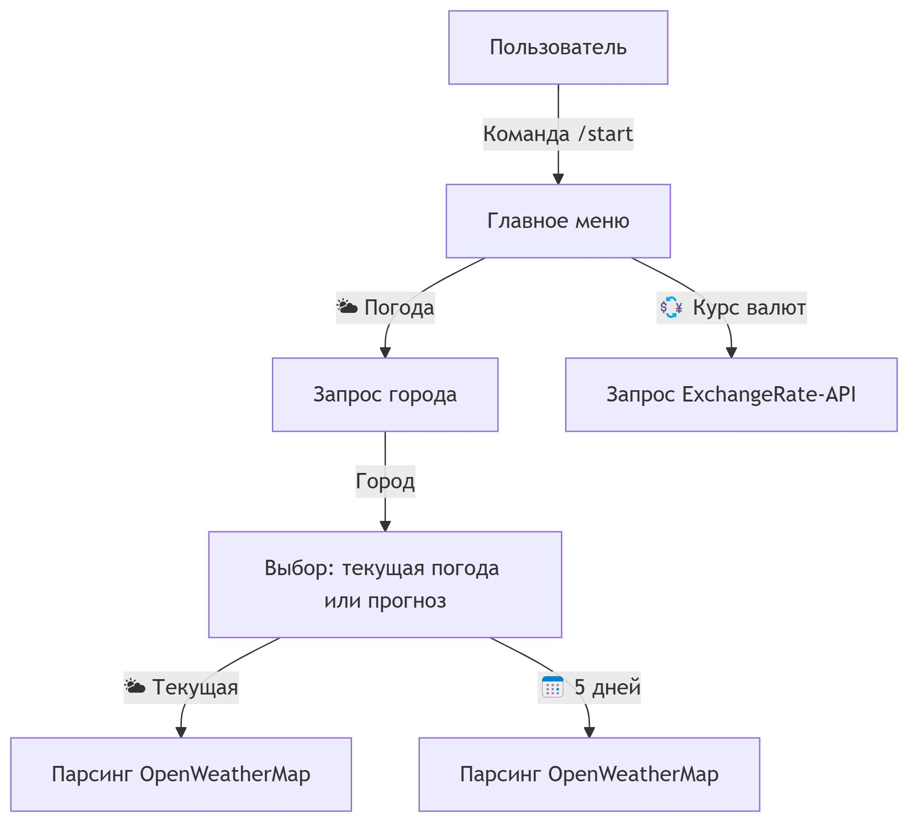

# Технология Telegram-бота для погоды и курсов валют

## Содержание

1. [Исследование предметной области](#исследование-предметной-области)  
2. [Техническое руководство по созданию](#техническое-руководство-по-созданию)  
   - [Подготовка окружения](#подготовка-окружения)  
   - [Создание Telegram-бота](#создание-telegram-бота)  
   - [Подключение API погоды и валют](#подключение-api-погоды-и-валют)  
   - [Обработка команд и сообщений](#обработка-команд-и-сообщений)  
3. [Примеры кода](#примеры-кода)  
4. [Иллюстрации](#иллюстрации)  
5. [Структура Git-репозитория](#структура-git-репозитория)  

---

## Исследование предметной области

### Цель проекта  
Создать собственного Telegram-бота

### Основные компоненты  
- **Telegram Bot API** — для общения с пользователем через чат-бота.  
- **OpenWeatherMap API** — для получения данных о погоде.  
- **ExchangeRate API** — для получения курсов валют.

### Основные задачи  
- Приветствие пользователя и показ главного меню.  
- Запрос города и отображение погоды на сегодня или на 5 дней.  
- Получение курса валют по запросу.  
- Обработка нажатий на кнопки и текстовых сообщений.

---

## Техническое руководство по созданию

### Подготовка окружения

1. Установите Python  
2. Установите необходимые библиотеки командой:

```bash
pip install python-telegram-bot aiohttp
```
3. Зарегистрировать Telegram-бота у BotFather и получить токен.
4. Зарегистрироваться на OpenWeatherMap и ExchangeRate API для получения ключей.
   
### Создание Telegram-бота

## Инициализация проекта и настройка токенов

Создайте файл `bot.py` и импортируйте нужные модули:

```python
from telegram import Update, InlineKeyboardButton, InlineKeyboardMarkup
from telegram.ext import (
    Application,
    CommandHandler,
    MessageHandler,
    ContextTypes,
    ConversationHandler,
    CallbackQueryHandler,
    filters
)
import aiohttp
import datetime
```
### Подключение API погоды и валют
Функции для запросов к API
```python
async def fetch_weather(city: str) -> str:
    url = f"http://api.openweathermap.org/data/2.5/forecast?q={city}&appid={WEATHER_API_KEY}&units=metric&lang=ru"
    async with aiohttp.ClientSession() as session:
        async with session.get(url) as response:
            data = await response.json()
            # Обработка данных
            return f"Погода в городе {city}: {data['list'][0]['weather'][0]['description']}, температура {data['list'][0]['main']['temp']}°C"
```
Аналогично создайте функцию для получения курса валют.

### Обработка команд и сообщений
Обработка нажатий на кнопки
```pyhton
async def button_handler(update: Update, context: ContextTypes.DEFAULT_TYPE):
    query = update.callback_query
    await query.answer()
    if query.data == 'weather':
        await query.message.reply_text("Введите название города для получения погоды:")
        return ASK_CITY
    elif query.data == 'exchange':
        await query.message.reply_text("Введите валютную пару (например, USD/RUB):")
        return ASK_CITY
```

### Примеры кода
Навигации кнопок
```python
def main_menu():
    keyboard = [
        [InlineKeyboardButton("🌤 Погода", callback_data='weather')],
        [InlineKeyboardButton("💱 Курс валют", callback_data='exchange')],
    ]
    return InlineKeyboardMarkup(keyboard)
```

Код запуска
```python
def main():
    application = Application.builder().token("ваш_токен_телеграм").build()

    conv_handler = ConversationHandler(
        entry_points=[CommandHandler("weather", weather_command)],
        states={ASK_CITY: [MessageHandler(filters.TEXT & ~filters.COMMAND, handle_city)]},
        fallbacks=[CommandHandler("cancel", cancel)],
    )

    application.add_handler(CommandHandler("start", start))
    application.add_handler(conv_handler)
    application.add_handler(CallbackQueryHandler(button_handler))
    application.add_handler(MessageHandler(filters.TEXT & ~filters.COMMAND, text_handler))

    application.run_polling()

if __name__ == '__main__':
    main()
```
### Иллюстрации
## Архитектура бота


## Логотип бота


### Структура Git-репозитория
```plaintext
/
bot/
├── README.md            # Это описание
├── bot.py               # Основной код бота
├── img/              # Папка с иллюстрациями
│   ├── 1040237.png    #Logo
```

