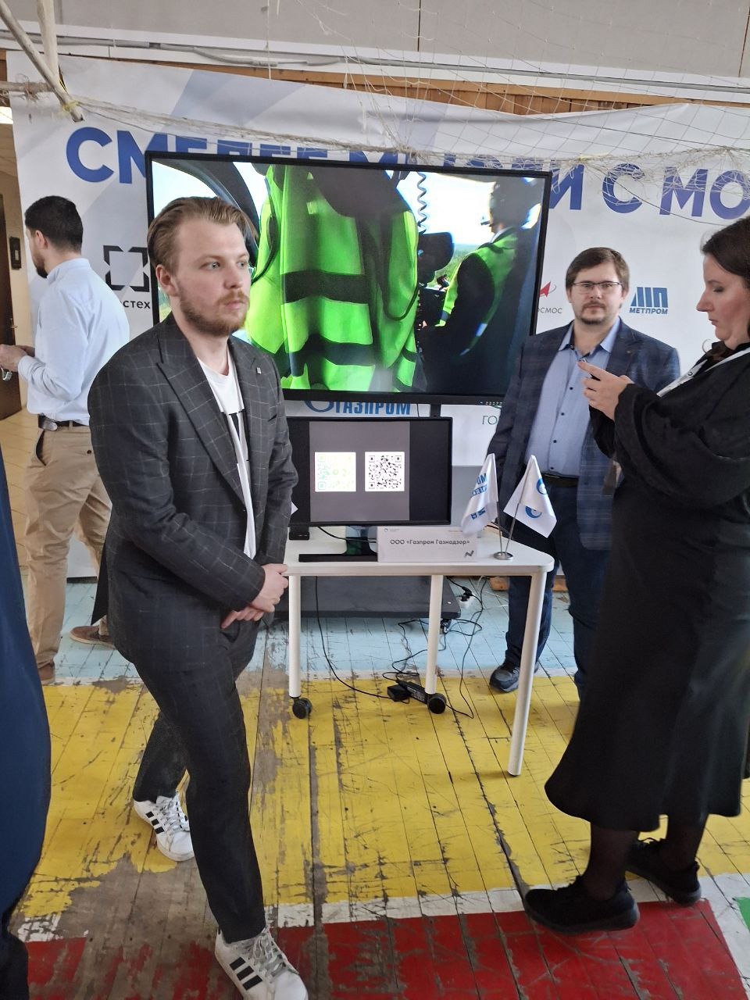
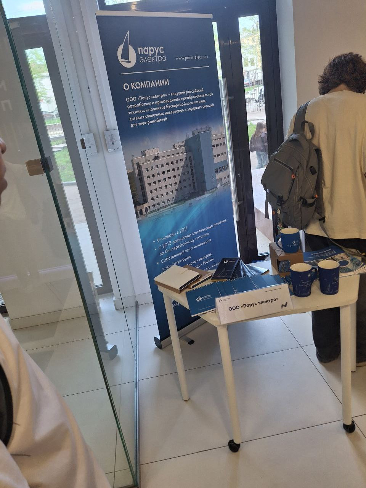
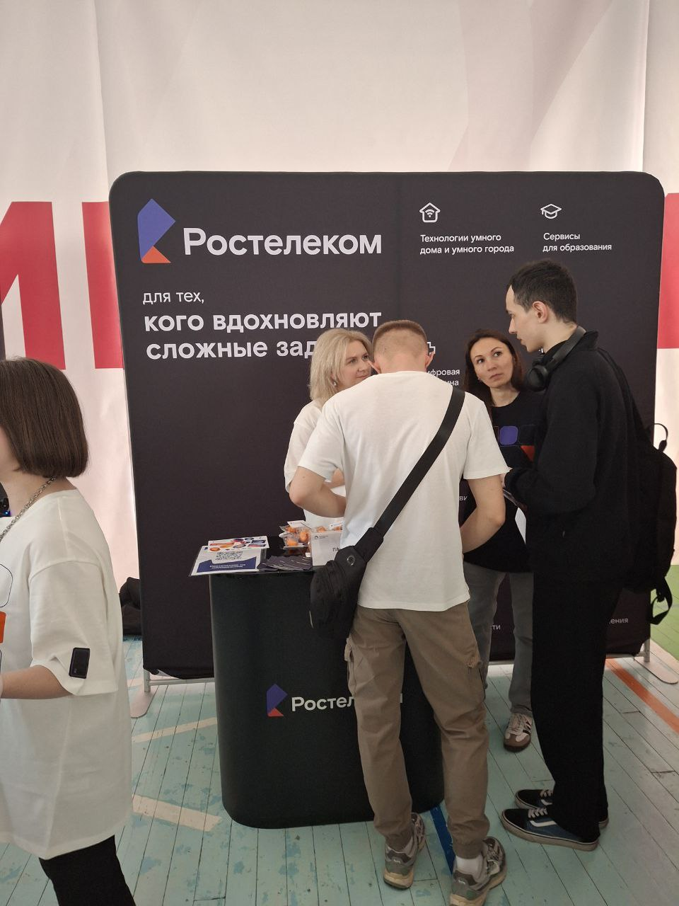
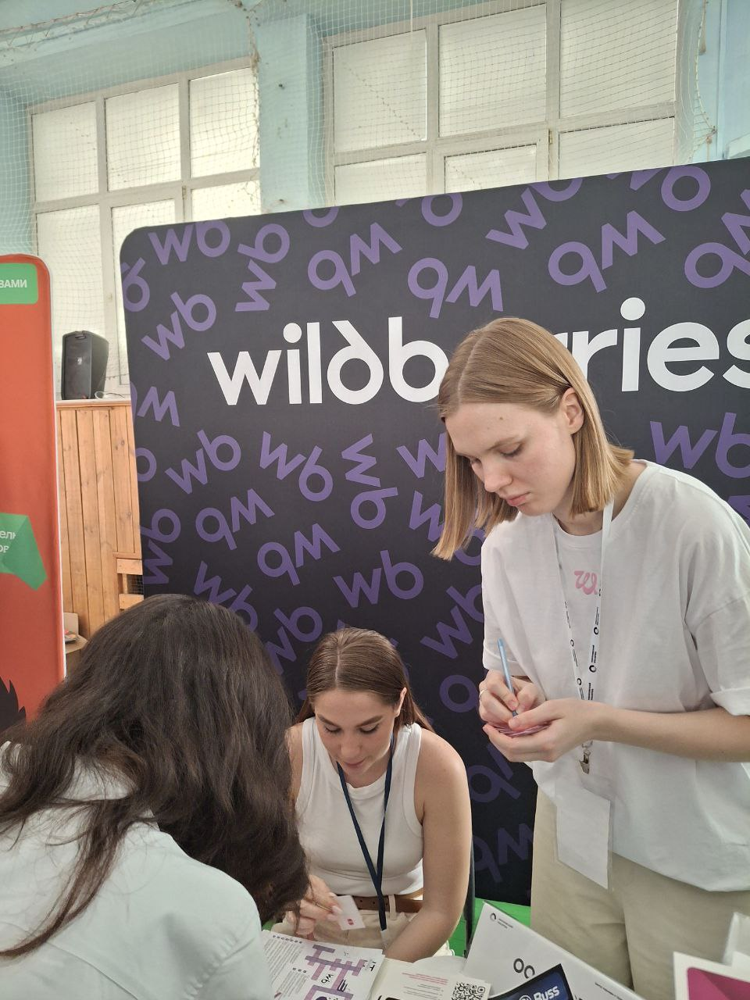
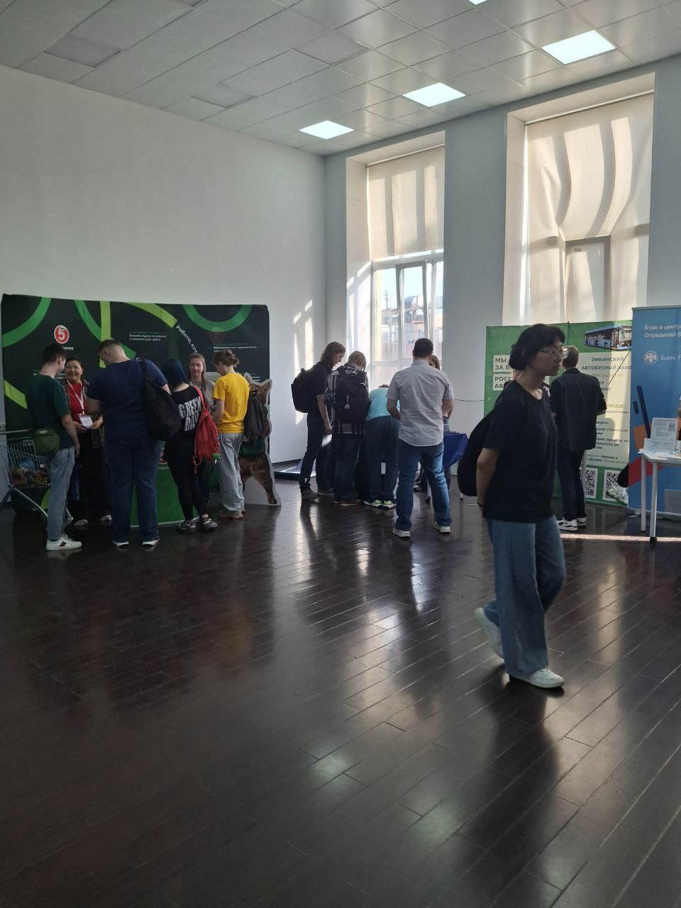

## Участие в карьерном марафоне

**Дата:** 22 апреля 2025 года  
**Формат:** Очное участие  
**Мероприятие:** Карьерный марафон 
**Место проведения:** [Московский политехнический университет]  

### Описание мероприятия

В рамках карьерного марафона прошли выступления представителей ведущих российских компаний, включая:

- ВТБ  
- Сбер  
- Wildberries  
- R-Vision  
- Ростелеком  
- Газпром  
- и другие

Каждая компания представила информацию о доступных вакансиях, стажировках, специфике работы в ИТ-сфере, карьерных треках и актуальных направлениях развития в цифровой экономике.

### Что было полезным

- Я узнал о требованиях работодателей к молодым специалистам и о возможностях прохождения стажировок.
- Получил представление о корпоративной культуре различных организаций.
- Узнал о возможностях карьерного роста внутри компаний и актуальных ИТ-направлениях, включая кибербезопасность, data science и автоматизацию бизнес-процессов.

### Интерактивная часть

Особенно запомнилось выступление представителей **Wildberries**, которое включало интерактивную **викторину** для участников.  
По результатам я получил **фирменный шоппер** — небольшой, но приятный бонус, который стал отличным завершением моего участия.

### Связь с проектом

Участие в карьерном марафоне позволило:

- Лучше понять, какие технологии и компетенции востребованы на рынке труда, что напрямую влияет на техническое развитие проекта **Lifeguard**.
- Уточнить требования работодателей к ИТ-продуктам в области безопасности.
- Получить идеи для потенциального развития проекта в сотрудничестве с крупными компаниями и дальнейшей его коммерциализации.

---

### Фотографии с мероприятия

Ниже представлены фотографии, сделанные во время участия в карьерном марафоне:

